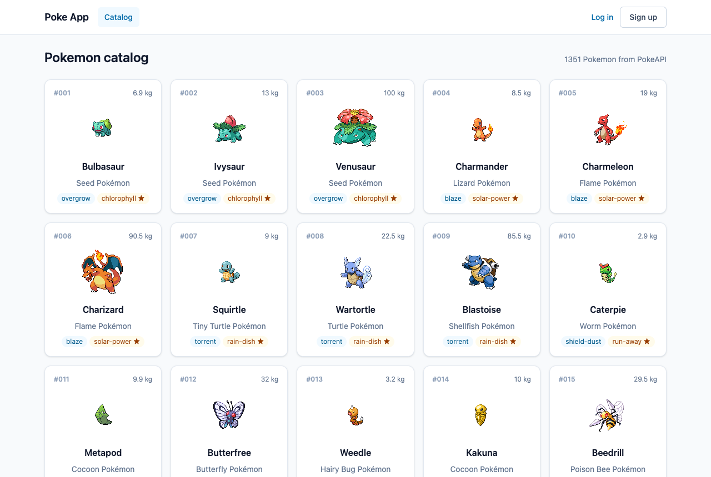
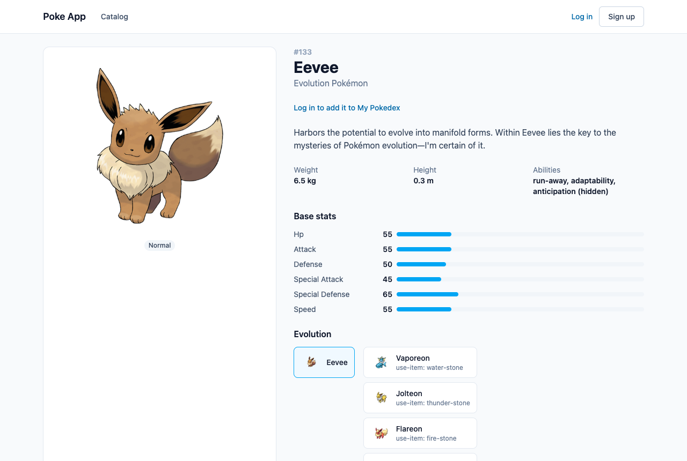
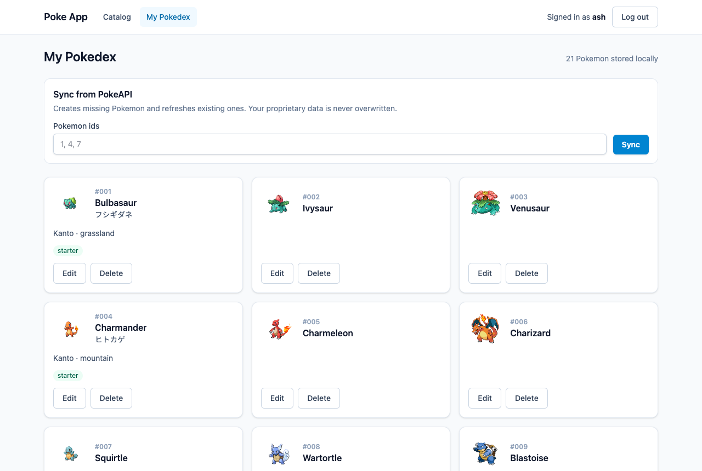
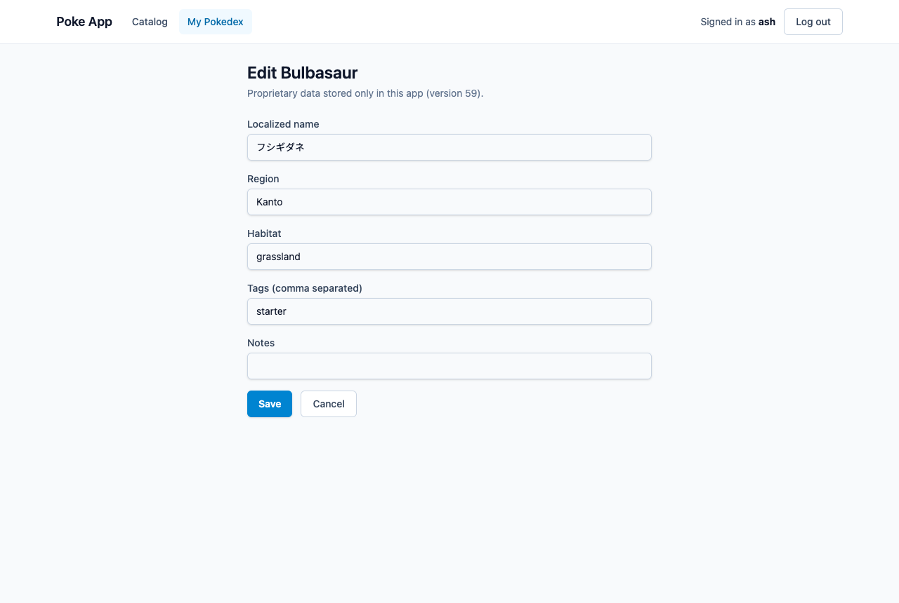
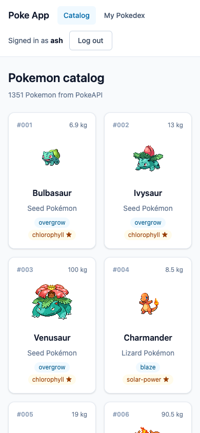
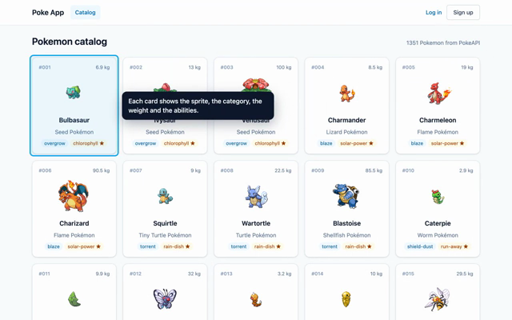
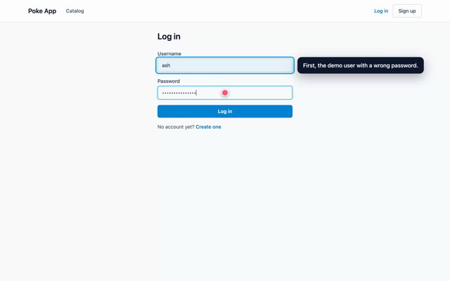
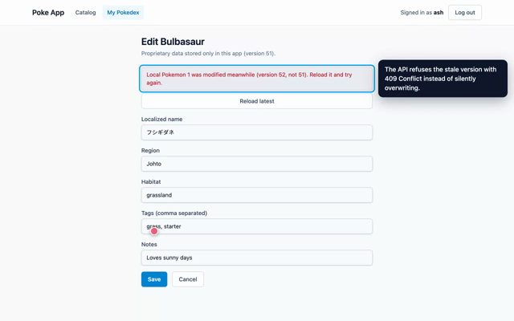

# Poke App

[](https://github.com/tiagosgalvao/poke-app/actions/workflows/api.yml) [](https://github.com/tiagosgalvao/poke-app/actions/workflows/web.yml) [](https://github.com/tiagosgalvao/poke-app/actions/workflows/e2e.yml)

A full-stack Pokemon application. It has a **Java / Spring Boot REST API** that integrates with [PokeAPI](https://pokeapi.co/docs/v2) and keeps a local relational replica that can be enriched with proprietary data, and a **React** web client that consumes the API.



> **Reviewing this project?** [Requirements and solutions](docs/REQUIREMENTS-AND-SOLUTIONS.md) maps every requirement of the exercise to how it is solved and where to check it.

## Purpose

The project shows how to build a robust backend service with **Clean Architecture** and **TDD**, plus a responsive, user-centric frontend on top of it. The service does three jobs:

- **Retrieves** Pokemon data from the public PokeAPI and caches it.
- **Replicates** selected Pokemon into a local PostgreSQL database.
- **Extends and modifies** those local records with proprietary fields that PokeAPI doesn't have: localized names, geographical metadata (region, habitat) and internal classification tags.

### User stories

| # | Story | What it delivers |
|---|---|---|
| **US01** | Pokemon enumeration | Browse Pokemon in paginated results. Each entry shows its sprite, category, weight and abilities. Responses are cached. |
| **US02** | Detailed view | Full data for a chosen Pokemon: image, base stats, description and evolution chain. |
| **US03** | Data synchronization | Persist Pokemon from PokeAPI into the local relational store, which then accepts proprietary fields. |
| **US04** | Local data modification | Update any locally stored Pokemon, with robust validation: 404 for missing records, 400 for malformed payloads, 409 for conflicts. |

### Technical goals

- **Clean Architecture:** the business layer is independent of both the web API and the data-access layer. An executable architecture test enforces this.
- **CRUD API:** full CRUD on the local dataset, using standard HTTP verbs and consistent response and error structures (RFC 9457 Problem Details).
- **Users:** user registration and authentication (JWT), with public and protected routes.
- **Data layer:** a dedicated data-access layer over PostgreSQL, with versioned migrations (Flyway).
- **Caching:** a caching layer for PokeAPI responses (Redis).
- **Testing:** thorough tests for every core component, written test-first.
- **Frontend:** a modern React SPA with clean component organization, efficient state management and no browser console warnings.
- **Ready to demo:** seeded demonstration data and credentials, and the whole stack runs in Docker.

## Tech stack

| | |
|---|---|
| **Backend** | Java 25 · Spring Boot 4.1 · Gradle (Kotlin DSL) · PostgreSQL 17 + Flyway · Redis 8 cache · JWT auth |
| **Frontend** | React 19 · TypeScript · Vite 8 · TanStack Query · Zustand · react-hook-form + zod · Tailwind CSS 4 |
| **Testing** | JUnit 5 · Mockito · WireMock · Testcontainers · ArchUnit · JaCoCo · Vitest · Testing Library · MSW |
| **Packaging** | Docker multi-stage images (Temurin 25, nginx) · Docker Compose |

## Running it

Prerequisites: Docker. For local development you also need JDK 25 and Node 24.

### Everything in Docker

```bash
cp .env.example .env        # optional: the defaults work as they are
docker compose up --build
```

| What | Where |
|---|---|
| Web app | http://localhost:3000 |
| API | http://localhost:8080/api/v1 |
| Swagger UI | http://localhost:8080/swagger-ui.html |
| Health | http://localhost:8080/actuator/health |

Compose starts four services: `postgres`, `redis`, `api` and `web`. Each waits for the previous one to be healthy. Flyway creates the schema and seeds the demo data on the first start. nginx serves the SPA and proxies `/api` to the API, so the browser only ever talks to one origin.

### Local development

```bash
docker compose up -d postgres redis

cd api && ./gradlew bootRun           # http://localhost:8080
cd web && npm install && npm run dev  # http://localhost:5173, proxies /api to :8080
```

**IDE:** open the repository root (`poke-app/`) in IntelliJ IDEA. The root `settings.gradle.kts` includes `api/` as a composite build, so Gradle is imported automatically. Set Gradle JVM to 25 if prompted.

### Configuration

Every setting comes from environment variables, with local defaults (see [.env.example](.env.example)):

| Variable | Default | Purpose |
|---|---|---|
| `POSTGRES_DB` / `POSTGRES_USER` / `POSTGRES_PASSWORD` | `poke` | Database |
| `JWT_SECRET` | a local dev secret | HS256 signing key, at least 32 bytes. Set a real one outside your machine: `openssl rand -base64 48` |
| `JWT_TTL` | `2h` | Token lifetime |
| `CACHE_TTL` | `24h` | How long PokeAPI responses stay in Redis |
| `POKEAPI_BASE_URL` | `https://pokeapi.co/api/v2` | Upstream API |
| `API_PORT` / `WEB_PORT` | `8080` / `3000` | Host ports |

## Demo data and credentials

| Username | Password |
|---|---|
| `ash` | `Pikachu123!` |
| `admin` | `Admin123!` |

The local store starts with 20 well-known Pokemon: the Kanto starters and their evolutions, Pikachu and Raichu, Eevee, Snorlax, Mewtwo, Mew and a few more. Some of them already carry proprietary data (localized name, region, habitat, tags, notes) and the rest are waiting to be enriched. You can also register a new account from the web app.

## Screenshots

| Detail with evolution chain (US02) | My Pokedex (US03) |
|---|---|
|  |  |
| **Editing proprietary data (US04)** | **Mobile** |
|  |  |

## Demo videos

Three narrated walkthroughs, recorded with Playwright against the running stack. Balloons explain each step next to the element in use. Click a thumbnail to watch the MP4.

| [](docs/demo/01-catalog-and-details.mp4) | [](docs/demo/02-accounts-and-protected-routes.mp4) | [](docs/demo/03-my-pokedex.mp4) |
|---|---|---|
| **1. Catalog and details** (1 min): US01 cards and pagination, US02 detail with stats, description and evolution chain | **2. Accounts and protected routes** (1 min): redirect to login and back, wrong password, log in and out, sign up | **3. My Pokedex** (2 min): US03 sync and import, US04 edit with validation, stale-edit 409, delete |

To record them again: `cd e2e && npm run demo` (see [docs/demo](docs/demo/)).

## API

Everything is under `/api/v1`. Reads are public and writes need a `Bearer` token from `/auth/login`. Spring Security validates the token before any controller runs: the HS256 signature, the algorithm and the expiry. The model and its accepted limits are in [ARCHITECTURE §8](docs/ARCHITECTURE.md#how-a-request-with-a-bearer-token-is-checked). The full contract, with request bodies, is in Swagger UI and [docs/ARCHITECTURE.md §6](docs/ARCHITECTURE.md#6-api-contract).

| Method | Path | Auth | Story | What it does |
|---|---|---|---|---|
| `POST` | `/auth/register` | public | | Creates an account (201) |
| `POST` | `/auth/login` | public | | Returns `{ accessToken, tokenType, expiresAt }` |
| `GET` | `/pokemon?page=&size=` | public | US01 | Paginated catalog from PokeAPI with sprite, category, weight and abilities (cached) |
| `GET` | `/pokemon/{idOrName}` | public | US02 | Image, types, stats, description and evolution chain (cached) |
| `GET` | `/local-pokemon?page=&size=` | public | US03 | Locally stored Pokemon, with proprietary data |
| `GET` | `/local-pokemon/{id}` | public | US03 | One local Pokemon |
| `POST` | `/local-pokemon` | token | US03 | Imports one Pokemon from PokeAPI (201, 409 if already local) |
| `POST` | `/local-pokemon/sync` | token | US03 | Creates or refreshes a batch of ids, keeping proprietary data |
| `PUT` | `/local-pokemon/{id}` | token | US04 | Replaces the proprietary fields |
| `PATCH` | `/local-pokemon/{id}` | token | US04 | Changes only the fields sent |
| `DELETE` | `/local-pokemon/{id}` | token | US04 | Removes a local Pokemon (204) |

Errors are RFC 9457 Problem Details with a `fieldErrors` list for validation:

| Status | When |
|---|---|
| 400 | Malformed JSON, invalid fields, bad path or query parameters |
| 401 | Missing, invalid or expired token on a protected route |
| 404 | Unknown local record or upstream Pokemon |
| 409 | Duplicate import or registration, or a stale `version` (optimistic locking) |
| 503 | PokeAPI is down or timing out |

## Testing

```bash
cd api && ./gradlew build   # unit, slice, WireMock and Testcontainers tests, ArchUnit, JaCoCo gate
cd web && npm test          # Vitest + Testing Library + MSW
cd web && npm run lint && npm run build
```

- The API build fails below 95% line or 90% branch coverage. The report is at `api/build/reports/jacoco/test/html/index.html`.
- `ArchitectureTest` (ArchUnit) enforces the layering: the domain is plain Java, services never touch controllers or persistence, and features have no cycles.
- PokeAPI is never called by the tests. WireMock replays recorded responses, and an end-to-end test runs the whole app against WireMock, Postgres and Redis containers.
- The web tests fail on any console error or warning, which keeps the browser console clean.

Docker must be running for the API tests (Testcontainers).

With the stack running, `cd e2e && npm install && npx playwright install chromium && npm test` runs the browser flows with Playwright. `npm run demo` plays the demo as three narrated chapters, with balloons explaining each step, and records them as MP4 into [docs/demo/](docs/demo/). Recording needs ffmpeg. The flows are described in the [end-to-end test plan](docs/E2E-TEST-PLAN.md).

`scripts/smoke-test.sh` runs the demo flow against it through the nginx proxy: catalog, detail, auth, sync, update, import and delete, plus the 400/401/404/409 paths. It needs `curl` and `jq`.

GitHub Actions runs the same checks on every push to `main` and on pull requests. `api.yml` runs the Gradle build with the coverage gate and uploads the test and JaCoCo reports. `web.yml` runs lint, tests and the production build. `e2e.yml` starts the whole stack with Docker Compose and runs the 11 Playwright checks against it, uploading the report if anything fails. Each workflow only runs when the folders it covers change, and each can also be started by hand from the Actions tab (`gh workflow run <name>.yml`).

## Documentation

- [API README](api/README.md): setup, configuration and what each backend dependency is for
- [Web README](web/README.md): scripts, structure, Docker image and what each frontend library is for
- [Requirements and solutions](docs/REQUIREMENTS-AND-SOLUTIONS.md): every requirement of the exercise mapped to its solution and evidence
- [Architecture](docs/ARCHITECTURE.md): layers, data model, API contract, caching, auth, testing
- [Decision log](docs/DECISIONS.md): why each technical choice was made (ADR-style)
- [PokeAPI reference](docs/POKEAPI.md): upstream endpoints, mapping and quirks
- [Roadmap](docs/ROADMAP.md): numbered tasks, one commit each, and the demo script
- [Conventions](docs/CONVENTIONS.md): commit format, code style and best practices
- [End-to-end test plan](docs/E2E-TEST-PLAN.md): the Playwright browser flows and the demo recordings
- [GenAI](docs/GENAI.md): the task-management API prompt exercise, and how AI was used (and corrected) on this project
- [CLAUDE.md](CLAUDE.md): working agreement for AI-assisted development

## Repository layout

```
api/                 Spring Boot service, feature-first: catalog · localpokemon · identity · shared
web/                 React SPA: features/catalog · features/local-pokemon · features/auth
docs/                design docs and screenshots
docker-compose.yml   postgres + redis + api + web
.github/workflows/   CI: api.yml, web.yml and e2e.yml
scripts/             smoke-test.sh, the end-to-end check against a running stack
e2e/                 Playwright: regression flows (tests/) and narrated demo chapters (demo/) recorded into docs/demo/
```
