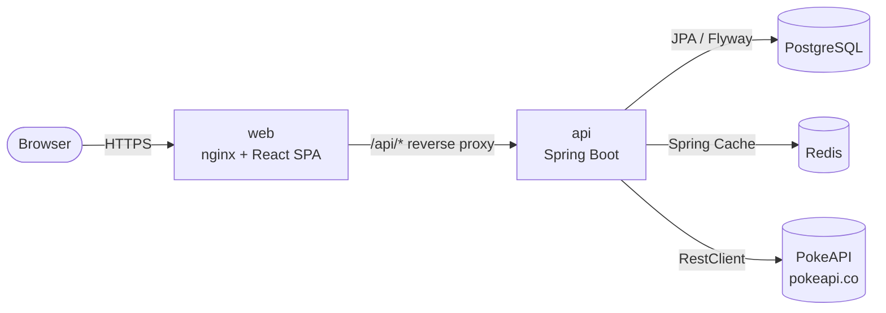
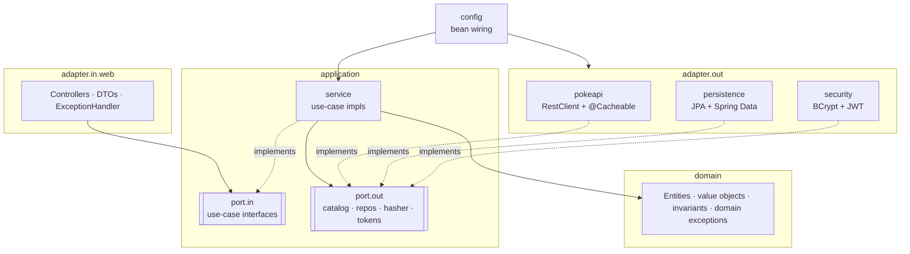
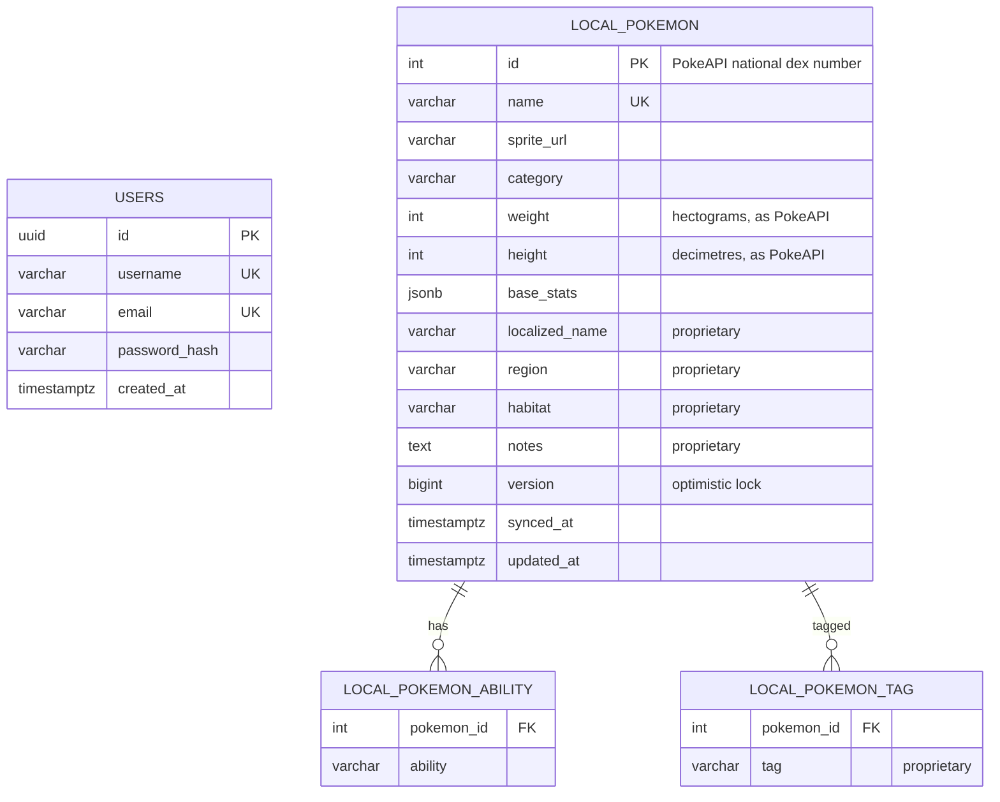
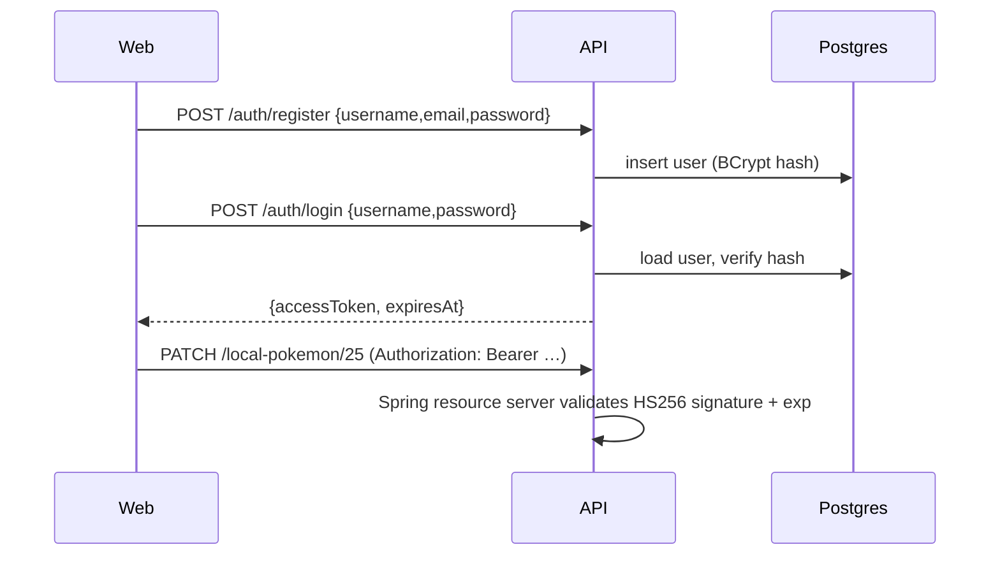

# Poke App: Architecture

This is the living design document for the Poke App, a Spring Boot API plus a React web client built as a Java technical exercise. It records **what** we are building and **how** it is structured. The **why** behind each choice is recorded in [DECISIONS.md](DECISIONS.md). Update it whenever a decision changes.

- [1. Scope](#1-scope)
- [2. User stories → API](#2-user-stories--api)
- [3. System overview](#3-system-overview)
- [4. Backend architecture (Clean / Hexagonal)](#4-backend-architecture-clean--hexagonal)
- [5. Data model](#5-data-model)
- [6. API contract](#6-api-contract)
- [7. PokeAPI integration & caching](#7-pokeapi-integration--caching)
- [8. Authentication (minimal JWT)](#8-authentication-minimal-jwt)
- [9. Frontend architecture](#9-frontend-architecture)
- [10. Testing strategy](#10-testing-strategy)
- [11. Runtime topology](#11-runtime-topology)
- [12. Decision log](#12-decision-log)

---

## 1. Scope

**In scope (from the spec):**

- REST API in Java/Spring Boot that consumes [PokeAPI](https://pokeapi.co/docs/v2).
- US01–US04: browse, detail, local sync, and local update.
- A relational store with a primary entity (local Pokemon) and a users collection.
- Full CRUD on the local dataset, with consistent responses and proper error handling (400/404/409…).
- User registration and authentication, with public and protected routes.
- A caching layer for PokeAPI responses.
- A dedicated data-access layer and a business layer that is independent of both API and persistence.
- Unit tests for every core component, written TDD-first.
- A responsive React frontend.
- Seeded demo data and credentials, Dockerfiles, a README, and a GenAI write-up.

**Out of scope (deliberately):**

- Refresh tokens, logout and token revocation.
- Roles and permissions beyond "authenticated vs anonymous".
- Email verification and password reset.
- Multi-tenancy.
- Deployment to a cloud provider.

## 2. User stories → API

| Story | What the user gets | Endpoint(s) | Auth |
|---|---|---|---|
| **US01** Enumeration | Paginated list showing sprite, category (genus), weight and abilities | `GET /api/v1/pokemon?page=0&size=20` | public |
| **US02** Detail | Image, base stats, description (flavor text) and evolution chain | `GET /api/v1/pokemon/{idOrName}` | public |
| **US03** Sync | Copy Pokemon from PokeAPI into Postgres so proprietary fields can be added | `POST /api/v1/local-pokemon/sync`, `POST /api/v1/local-pokemon` | **required** |
| **US04** Update | Edit local records, with 400/404/409 handled | `PUT` / `PATCH /api/v1/local-pokemon/{id}` | **required** |
| CRUD (tech req.) | List, read and delete the local records | `GET /api/v1/local-pokemon[/{id}]`, `DELETE /api/v1/local-pokemon/{id}` | read public, delete **required** |
| Auth (tech req.) | Register and log in | `POST /api/v1/auth/register`, `POST /api/v1/auth/login` | public |

**Proprietary fields** (the spec mentions localized names, geographical metadata and internal classification tags):

| Field | Type | Purpose |
|---|---|---|
| `localizedName` | text | Localized nomenclature, e.g. "ピカチュウ" |
| `region` | text | Geographical metadata, e.g. "Kanto" |
| `habitat` | text | Geographical metadata, e.g. "forest" |
| `tags` | set of text | Internal classification tags, e.g. `starter`, `legendary` |
| `notes` | text | Free-form internal notes |

## 3. System overview



The repository is a monorepo:

```
poke-app/
├── api/                  Spring Boot 4.1 · Java 25 · Gradle Kotlin DSL
├── web/                  React 19 · TypeScript · Vite 8
├── docs/                 this file, DECISIONS.md, POKEAPI.md, CONVENTIONS.md, ROADMAP.md, GENAI.md (later)
├── docker-compose.yml    postgres + redis (+ api + web once Dockerfiles land)
├── .env.example
└── CLAUDE.md             working agreement for AI-assisted development
```

## 4. Backend architecture (Clean / Hexagonal)



**The dependency rule:** source dependencies point inward only.

| Layer | Package | May depend on | Must not depend on |
|---|---|---|---|
| Domain | `com.poke.domain` | JDK only | everything else, including Spring, JPA and Jackson |
| Application | `com.poke.application` | `domain` | adapters, config, Spring, JPA, HTTP |
| Adapters | `com.poke.adapter..` | `application`, `domain`, frameworks | other adapters (in ↛ out), config |
| Config | `com.poke.config` | everything | — (nothing depends on config) |

`ArchitectureTest` (ArchUnit) enforces these rules, so a violation fails the build.

**Consequences:**

- Use-case services are **plain Java classes**. They are instantiated as `@Bean`s in `config`, not annotated with `@Service`, which makes them unit-testable with no Spring context.
- JPA entities live in `adapter.out.persistence` and are mapped to and from domain objects. Domain objects are never annotated with `@Entity`.
- Web DTOs are records in `adapter.in.web`, and the domain never leaks out of a controller.
- Bean Validation on the DTOs handles *shape* (required fields, lengths, formats). Business invariants live in the domain, such as "a localized name may not be blank" or "at most 10 tags". Both layers map to 400.
- Transactions are opened at the adapter or config boundary, never inside the domain.

## 5. Data model



- The primary key is the PokeAPI id. A record has exactly one upstream origin, so re-syncing is idempotent and duplicates map to 409.
- Flyway owns the schema (`ddl-auto: validate`). Planned migrations:
  - `V1__schema.sql`
  - `V2__seed_users.sql`
  - `V3__seed_local_pokemon.sql`, which seeds about 20 Pokemon so the demo works offline.
- Re-syncing refreshes the upstream fields and **never overwrites** the proprietary ones.

## 6. API contract

- Every resource is under the base path `/api/v1`. OpenAPI docs are served at `/swagger-ui.html`.
- **Collections** return:
  ```json
  { "content": [...], "page": 0, "size": 20, "totalElements": 1302, "totalPages": 66 }
  ```
  `size` is capped at 50, and a value outside the range returns 400.
- **Errors** are [RFC 9457](https://www.rfc-editor.org/rfc/rfc9457) `application/problem+json`:
  ```json
  { "type": "about:blank", "title": "Bad Request", "status": 400,
    "detail": "Validation failed", "instance": "/api/v1/local-pokemon/25",
    "fieldErrors": [ { "field": "localizedName", "message": "must not be blank" } ] }
  ```

| Situation | Status |
|---|---|
| Malformed JSON, invalid field, bad path or query param | 400 |
| Missing or invalid token on a protected route | 401 |
| Local record or upstream Pokemon not found | 404 |
| Duplicate import/registration, stale `version` on update | 409 |
| PokeAPI timeout or 5xx | 503 |
| Anything unexpected | 500 (generic body, details only in logs) |

- `PUT` replaces the editable fields and requires `version`. `PATCH` updates only the fields present (JSON merge-patch semantics) and also requires `version`.
- `POST /local-pokemon/sync` accepts `{ "ids": [1, 4, 7] }` or `{ "fromId": 1, "toId": 20 }`, with at most 50 per call. It returns a summary of `created`, `refreshed` and `failed`.

## 7. PokeAPI integration & caching

The upstream endpoints, payloads, field mapping and quirks are documented in [POKEAPI.md](POKEAPI.md).

- **Client:** Spring `RestClient` with connect and read timeouts. The base URL is configurable through `POKEAPI_BASE_URL`, so tests point it at WireMock.
- **US01 list:** `GET /pokemon?offset&limit` returns only names and URLs. For each entry, the client then fetches `/pokemon/{id}` (sprite, weight, abilities) and `/pokemon-species/{id}` (English `genus`, which is the category). These run in parallel on virtual threads ([D19](DECISIONS.md#d19-virtual-threads-enabled-globally)).
- **US02 detail:** `/pokemon/{id}`, `/pokemon-species/{id}` (English flavor text, with `\f` and `\n` normalized), then `evolution_chain.url`. The chain tree is flattened into ordered stages; branches such as Eevee are kept as siblings.
- **Caching:** Spring Cache backed by Redis, with JSON values and a 24 h TTL (`CACHE_TTL`), since PokeAPI data is effectively static. Caching happens per upstream resource: `pokemon`, `species`, `evolution-chain` and `pokemon-page`. Different pages that share Pokemon therefore reuse the same entries.
- **Resilience:** a custom `CacheErrorHandler` logs Redis failures and falls through to PokeAPI, so a cache outage never breaks the API. Upstream 404 becomes a domain `PokemonNotFoundException` (404), and timeouts or 5xx become `ExternalServiceUnavailableException` (503).

## 8. Authentication (minimal JWT)

The spec requires "user registration, authentication, and the management of protected versus public routes". We implement the smallest design that satisfies it:



- Passwords are hashed with BCrypt. Login never says which half of the credentials was wrong.
- Tokens are HS256 JWTs signed with `JWT_SECRET` (at least 32 bytes) and expire after `JWT_TTL` (2 h by default). Spring Boot's built-in `oauth2-resource-server` validates them, so there is no hand-written filter.
- There is a single implicit role. `GET` on the catalog and on local reads is public. Every mutation and the sync endpoint require a valid token.
- 401 and 403 responses are ProblemDetail JSON, produced by a custom entry point and access-denied handler.
- The API is stateless: no sessions, and CSRF is disabled because there are no cookies.
- The seeded demo users are `admin / Admin123!` and `ash / Pikachu123!`.

## 9. Frontend architecture

| Concern | Choice |
|---|---|
| Build / dev server | Vite 8. The dev server proxies `/api` to `localhost:8080`. |
| Routing | React Router (data router) |
| Server state | TanStack Query: caching, pagination, invalidation after mutations |
| Client state | Zustand auth store holding the token and user, persisted to `localStorage` |
| Forms / validation | react-hook-form with zod schemas that mirror the API rules |
| Styling | Tailwind CSS v4, mobile-first responsive grid |
| Lint | oxlint |
| Tests | Vitest, Testing Library and MSW (the API is mocked at the network layer) |

```
web/src/
├── api/            typed fetch client, ProblemDetail parsing, auth header, 401 → logout
├── features/
│   ├── catalog/    US01 list + US02 detail (hooks, components)
│   ├── local/      US03 sync + US04 edit + CRUD (My Pokedex)
│   └── auth/       login / register forms, auth store, <RequireAuth>
├── components/     shared UI (Pagination, StatBar, ErrorState, Skeleton…)
├── routes/         router + layouts
└── test/           Vitest setup, MSW handlers
```

**Pages:**

| Route | Purpose | Access |
|---|---|---|
| `/` | Catalog grid | public |
| `/pokemon/:id` | Detail view | public |
| `/login`, `/register` | Authentication forms | public |
| `/my-pokedex` | Local records, sync dialog, edit form, delete with an in-page confirm | protected |

**Quality bar:** no console warnings, accessible labels, keyboard-navigable dialogs, and loading, empty and error states on every query.

## 10. Testing strategy

TDD workflow: write a failing test, make it pass, then refactor. Commit history should show tests landing with, or before, the code they cover.

| Level | Tooling | What |
|---|---|---|
| Domain & use cases | JUnit 5, AssertJ, Mockito | Invariants and orchestration; ports are mocked. This is the bulk of the suite. |
| Web adapter | `@WebMvcTest` + Spring Security test | Status codes, validation → 400, ProblemDetail shape, public vs protected routes |
| PokeAPI adapter | WireMock + JSON fixtures | Mapping (Pikachu, Eevee's branching chain), 404, 5xx, timeout |
| Persistence adapter | `@DataJpaTest` + Testcontainers Postgres | Flyway migrations, mapping, optimistic locking |
| End-to-end | `@SpringBootTest` + Testcontainers (Postgres, Redis) + WireMock | Register → login → sync → update → error paths; a cache hit on the second call |
| Architecture | ArchUnit | Dependency rule ([§4](#4-backend-architecture-clean--hexagonal)) |
| Web | Vitest + Testing Library + MSW | Catalog renders and paginates, login flow, edit form validation and server errors |

Coverage comes from JaCoCo, with a reporting target of ≥ 80% on `domain` and `application`.

## 11. Runtime topology

| Mode | How |
|---|---|
| Everything in Docker | `docker compose up --build` serves the web app at http://localhost:3000 and the API at http://localhost:8080 |
| Local dev | `docker compose up -d postgres redis`, then `./gradlew bootRun` in `api/` and `npm run dev` in `web/` (http://localhost:5173) |
| Tests | Testcontainers starts its own Postgres and Redis; only Docker is required |

The api image is multi-stage: Temurin 25 JDK to build, then Temurin 25 JRE to run, as a non-root user with an actuator healthcheck. The web image builds with Node and is served by `nginx:alpine`, with an SPA fallback and a `/api` reverse proxy to `api:8080`, so the browser never makes cross-origin calls.

Configuration is driven by environment variables (see `.env.example`), with sensible local defaults in `application.yml`.

## 12. Decision log

All architecture decisions (D1–D19), with their context, consequences and the alternatives considered, are recorded in **[DECISIONS.md](DECISIONS.md)**.
