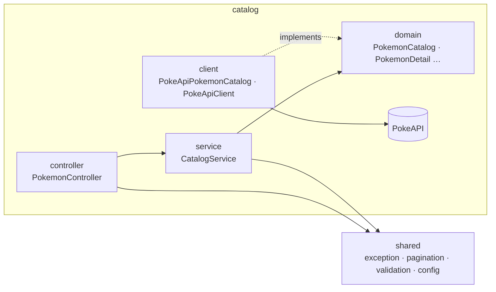
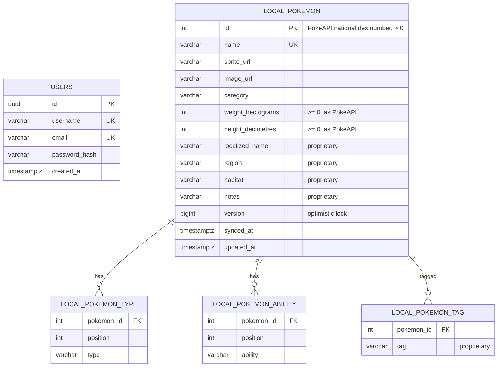
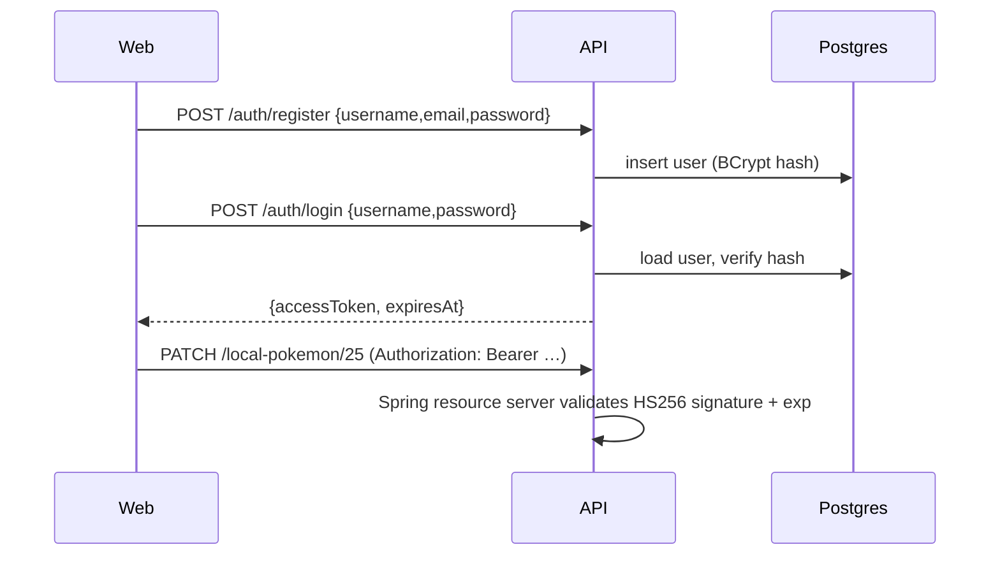

# Poke App: Architecture

This is the living design document for the Poke App, a Spring Boot API plus a React web client built as a Java technical exercise. It records **what** we are building and **how** it is structured. The **why** behind each choice is recorded in [DECISIONS.md](DECISIONS.md). Update it whenever a decision changes.

- [1. Scope](#1-scope)
- [2. User stories → API](#2-user-stories--api)
- [3. System overview](#3-system-overview)
- [4. Backend architecture (feature-first Clean Architecture)](#4-backend-architecture-feature-first-clean-architecture)
- [5. Data model](#5-data-model)
- [6. API contract](#6-api-contract)
- [7. PokeAPI integration & caching](#7-pokeapi-integration--caching)
- [8. Authentication (minimal JWT)](#8-authentication-minimal-jwt)
- [9. Frontend architecture](#9-frontend-architecture)
- [10. Testing strategy](#10-testing-strategy)
- [11. Runtime topology](#11-runtime-topology)
- [12. Decision log](#12-decision-log)

---

## 1. Scope

**In scope (from the spec):**

- REST API in Java/Spring Boot that consumes [PokeAPI](https://pokeapi.co/docs/v2).
- US01–US04: browse, detail, local sync, and local update.
- A relational store with a primary entity (local Pokemon) and a users collection.
- Full CRUD on the local dataset, with consistent responses and proper error handling (400/404/409…).
- User registration and authentication, with public and protected routes.
- A caching layer for PokeAPI responses.
- A dedicated data-access layer and a business layer that is independent of both API and persistence.
- Unit tests for every core component, written TDD-first.
- A responsive React frontend.
- Seeded demo data and credentials, Dockerfiles, a README, and a GenAI write-up.

**Out of scope (deliberately):**

- Refresh tokens, logout and token revocation.
- Roles and permissions beyond "authenticated vs anonymous".
- Email verification and password reset.
- Multi-tenancy.
- Deployment to a cloud provider.

## 2. User stories → API

| Story | What the user gets | Endpoint(s) | Auth |
|---|---|---|---|
| **US01** Enumeration | Paginated list showing sprite, category (genus), weight and abilities | `GET /api/v1/pokemon?page=0&size=20` | public |
| **US02** Detail | Image, base stats, description (flavor text) and evolution chain | `GET /api/v1/pokemon/{idOrName}` | public |
| **US03** Sync | Copy Pokemon from PokeAPI into Postgres so proprietary fields can be added | `POST /api/v1/local-pokemon/sync`, `POST /api/v1/local-pokemon` | **required** |
| **US04** Update | Edit local records, with 400/404/409 handled | `PUT` / `PATCH /api/v1/local-pokemon/{id}` | **required** |
| CRUD (tech req.) | List, read and delete the local records | `GET /api/v1/local-pokemon[/{id}]`, `DELETE /api/v1/local-pokemon/{id}` | read public, delete **required** |
| Auth (tech req.) | Register and log in | `POST /api/v1/auth/register`, `POST /api/v1/auth/login` | public |

**Proprietary fields** (the spec mentions localized names, geographical metadata and internal classification tags):

| Field | Type | Purpose |
|---|---|---|
| `localizedName` | text | Localized nomenclature, e.g. "ピカチュウ" |
| `region` | text | Geographical metadata, e.g. "Kanto" |
| `habitat` | text | Geographical metadata, e.g. "forest" |
| `tags` | set of text | Internal classification tags, e.g. `starter`, `legendary` |
| `notes` | text | Free-form internal notes |

## 3. System overview


The repository is a monorepo:

```
poke-app/
├── api/                  Spring Boot 4.1 · Java 25 · Gradle Kotlin DSL · feature-first packages
├── web/                  React 19 · TypeScript · Vite 8
├── docs/                 this file, DECISIONS.md, POKEAPI.md, CONVENTIONS.md, ROADMAP.md, GENAI.md, screenshots/
├── docker-compose.yml    postgres + redis + api + web
├── settings.gradle.kts   composite build including api/, so IDEs import Gradle from the repo root
├── .env.example
└── CLAUDE.md             working agreement for AI-assisted development
```

## 4. Backend architecture (feature-first Clean Architecture)

The code is organised **by feature** (a bounded context, in DDD terms). Each feature uses the familiar Spring layers **controller → service → client/repository**, named the way they're named in most Spring projects. The Clean Architecture dependency rule applies inside each feature: dependencies point inward, toward the domain.

```
com.poke
├── shared/                 shared kernel, used by every feature
│   ├── exception/          DomainException hierarchy; handler/GlobalExceptionHandler (ProblemDetail)
│   ├── pagination/         Page, PageRequest, PageResponse
│   ├── measure/            Measures (PokeAPI hectograms/decimetres → kg/m)
│   ├── validation/         Require (domain guards, see D20)
│   └── config/             SecurityConfig
├── catalog/                US01–US02: the public Pokedex, read from PokeAPI
│   ├── domain/             PokemonSummary, PokemonDetail, Ability, Stat, EvolutionStage, PokemonKey,
│   │                       PokemonNotFoundException, PokemonCatalog (interface)
│   ├── service/            CatalogService
│   ├── client/             PokeApiClient (RestClient + cache), PokeApiPokemonCatalog (implements PokemonCatalog),
│   │                       PokeApiMapper, EvolutionChainFlattener, FlavorText, PokeApiCacheConfig, dto/, enums/
│   └── controller/         PokemonController, PokemonResponses
├── localpokemon/           US03–US04 (Phase 2): domain/, service/, repository/ (Spring Data JPA), entity/, controller/
└── identity/               Phase 3: users, registration, login (JWT)
```



**The dependency rule:**

| Package | Holds | May depend on | Must not depend on |
|---|---|---|---|
| `domain` | Business types, invariants, domain exceptions, and the interfaces the feature needs from outside (`PokemonCatalog`, later `LocalPokemonRepository`) | `shared.exception`, `shared.pagination`, `shared.validation`, the JDK | Spring, JPA, Jackson; every other package |
| `service` | `@Service` classes that orchestrate the domain (`@Transactional` from Phase 2) | `domain`, `shared.exception`, `shared.pagination` | `controller`, `client`, `repository`, `entity` |
| `client` | Outbound HTTP: RestClient, DTOs, mapping, caching. Implements domain interfaces. | `domain`, frameworks | `controller`, `service` |
| `repository` / `entity` | Spring Data JPA repositories and `@Entity` classes. Implement domain interfaces. | `domain`, frameworks | `controller`, `service` |
| `security` (identity) | BCrypt password hashing and JWT issuing. Implement domain interfaces. | `domain`, `shared.config`, frameworks | `controller`, `service` |
| `controller` | REST controllers, request/response records | `service`, `domain`, `shared.pagination` | `client`, `repository`, `entity` |
| `shared` | The kernel used by every feature: exceptions and their HTTP mapping, pagination, domain guards, security config | the JDK, Spring (`GlobalExceptionHandler` and `config` only) | any feature |

`ArchitectureTest` (ArchUnit) enforces these rules and also checks that features have no dependency cycles between them. A violation fails the build.

**Consequences:**

- **The domain stays pure Java**, so it's unit-tested with no Spring context.
- **Services are ordinary `@Service` beans** and never touch HTTP or JPA types directly.
- **Dependency inversion only where it pays off: outbound I/O.** The service depends on `PokemonCatalog`, a domain interface, and `PokeApiPokemonCatalog` implements it with RestClient. In Phase 2, the local Pokedex works the same way with a `LocalPokemonRepository` interface implemented with Spring Data JPA. Inbound, controllers call services directly; there are no use-case interfaces.
- **JPA entities stay in `entity`** and are mapped to and from domain objects. Response DTOs are records next to the controllers, so the domain never leaks out of a controller.
- **Validation is split by where data comes from** ([D20](DECISIONS.md#d20-validation-domain-guards-for-upstream-data-bean-validation-for-requests)). Domain constructors guard invariants whatever the entry point, including upstream PokeAPI data. Bean Validation (`@Valid` + annotations) validates request DTOs at the controller from Phase 2. Both map to 400.
- **Features talk to each other only through `service` classes.** For example, local Pokemon sync will call `CatalogService`.

## 5. Data model

The schema is created by `V1__schema.sql`:



- The primary key is the PokeAPI id. A record has exactly one upstream origin, so re-syncing is idempotent and duplicates map to 409.
- Types and abilities keep PokeAPI's order (`position`). Tags are a set. All three cascade on delete.
- Flyway owns the schema (`ddl-auto: validate`). Migrations:
  - `V1__schema.sql`: tables and constraints;
  - `V2__seed_local_pokemon.sql`: about 20 Pokemon so the demo works offline (task 2.8);
  - `V3__seed_users.sql`: the demo users (task 3.5).
- Re-syncing refreshes the upstream fields and **never overwrites** the proprietary ones.

## 6. API contract

- Every resource is under the base path `/api/v1`. OpenAPI docs are served at `/swagger-ui.html`.
- **Collections** return:
  ```json
  { "content": [...], "page": 0, "size": 20, "totalElements": 1351, "totalPages": 68 }
  ```
  `size` is capped at 50, and a value outside the range returns 400.
- **Errors** are [RFC 9457](https://www.rfc-editor.org/rfc/rfc9457) `application/problem+json`, produced by `shared.exception.handler.GlobalExceptionHandler`:
  ```json
  { "title": "Not Found", "status": 404,
    "detail": "Pokemon 'missingno' was not found", "instance": "/api/v1/pokemon/missingno" }
  ```
  From Phase 2, request-body validation errors add a `fieldErrors` extension:
  ```json
  { "title": "Bad Request", "status": 400, "detail": "Validation failed", "instance": "/api/v1/local-pokemon/25",
    "fieldErrors": [ { "field": "localizedName", "message": "must not be blank" } ] }
  ```

| Situation | Status |
|---|---|
| Malformed JSON, invalid field, bad path or query param | 400 |
| Missing or invalid token on a protected route | 401 |
| Local record or upstream Pokemon not found | 404 |
| Duplicate import/registration, stale `version` on update | 409 |
| PokeAPI timeout or 5xx | 503 |
| Anything unexpected | 500 (generic body, details only in logs) |

**Local Pokedex endpoints** (`/api/v1/local-pokemon`, implemented in `localpokemon.controller.LocalPokemonController`):

| Method and path | Body | Success | Errors |
|---|---|---|---|
| `GET /` (`page`, `size`) | — | 200 `PageResponse` | 400 |
| `GET /{id}` | — | 200 | 404 |
| `POST /` | `{ "idOrName": "pikachu" }` | 201 | 400, 404 (unknown upstream), 409 (already local), 503 |
| `PUT /{id}` | `version` + every proprietary field | 200 | 400, 404, 409 (stale `version`) |
| `PATCH /{id}` | `version` + only the fields to change | 200 | 400, 404, 409 |
| `DELETE /{id}` | — | 204 | 404 |
| `POST /sync` | `{ "ids": [1, 4, 7] }` or `{ "fromId": 1, "toId": 20 }` | 200 `{ created, refreshed, failed }` | 400, 503 |

- `PUT` replaces all proprietary fields: omitted ones become empty. `PATCH` changes only the fields that are present and not null, so a field is cleared with `PUT`. Both require the current `version`.
- Sync takes at most 50 ids per call. It creates missing Pokemon and refreshes existing ones without touching proprietary data. Ids PokeAPI doesn't know are reported as `failed`. A PokeAPI outage aborts the whole batch (503), and nothing is saved.
- Request bodies are validated with Bean Validation: lengths, a not-blank rule for present text fields, tags (letters, digits, hyphens, at most 10) and a required `version`. Violations return 400 with `fieldErrors`.

## 7. PokeAPI integration & caching

The upstream endpoints, payloads, field mapping and quirks are documented in [POKEAPI.md](POKEAPI.md).

- **Client:** Spring `RestClient` with connect and read timeouts. The base URL is configurable through `POKEAPI_BASE_URL`, so tests point it at WireMock.
- **US01 list:** `GET /pokemon?offset&limit` returns only names and URLs. For each entry, the client then fetches `/pokemon/{id}` (sprite, weight, abilities) and `/pokemon-species/{id}` (English `genus`, which is the category). These run in parallel on virtual threads ([D19](DECISIONS.md#d19-virtual-threads-enabled-globally)).
- **US02 detail:** `/pokemon/{id}`, `/pokemon-species/{id}` (the latest English flavor text, with `\f`, `\n` and soft hyphens normalized), then `evolution_chain.url`. The chain tree is flattened into ordered stages; branches such as Eevee are kept as siblings.
- **Caching:** Spring Cache backed by Redis, with a 24 h TTL (`CACHE_TTL`), since PokeAPI data is effectively static. `@Cacheable` sits on the PokeAPI client, so the cached values are the trimmed upstream responses, stored as JSON. Caching happens per upstream resource: `pokemon`, `species`, `evolution-chain` and `pokemon-page`. Different pages that share Pokemon therefore reuse the same entries.
- **Resilience:** Spring's `LoggingCacheErrorHandler`, combined with 500 ms Redis timeouts, logs Redis failures and falls through to PokeAPI, so a cache outage never breaks the API. Upstream 404 becomes an empty result, which `CatalogService` turns into `PokemonNotFoundException` (404). Timeouts, 5xx and malformed responses become `ExternalServiceUnavailableException` or its subtype `MalformedPokeApiResponseException` (503).

## 8. Authentication (minimal JWT)

The spec requires "user registration, authentication, and the management of protected versus public routes". We implement the smallest design that satisfies it:



- Passwords are hashed with BCrypt. Login never says which half of the credentials was wrong.
- Tokens are HS256 JWTs signed with `JWT_SECRET` (at least 32 bytes) and expire after `JWT_TTL` (2 h by default). Spring Boot's built-in `oauth2-resource-server` validates them, so there is no hand-written filter.
- There is a single implicit role. `shared.config.SecurityConfig` defines the rules:
  - **Public:** every `GET /api/v1/**` (the catalog and local reads), `POST /api/v1/auth/**` (register and login), health, info, OpenAPI and Swagger UI.
  - **Requires a valid token:** everything else, meaning every local Pokemon mutation and sync.
- 401 and 403 responses are ProblemDetail JSON, produced by `ProblemDetailSecurityHandler` (the entry point and access-denied handler).
- The HS256 key, `JwtEncoder` and `JwtDecoder` live in `shared.config.JwtConfig`. `identity.security.JwtTokenIssuer` signs tokens with the subject = username, a `uid` claim, `iat` and `exp`.
- The API is stateless: no sessions, and CSRF is disabled because there are no cookies.
- The seeded demo users (`V3__seed_users.sql`) are `admin / Admin123!` and `ash / Pikachu123!`.
- Swagger UI shows an **Authorize** button (`bearerAuth`, set up by `shared.config.OpenApiConfig`). Only the operations that need a token are marked as secured.

## 9. Frontend architecture

| Concern | Choice |
|---|---|
| Build / dev server | Vite 8. The dev server proxies `/api` to `localhost:8080`. |
| Routing | React Router (data router) |
| Server state | TanStack Query: caching, pagination, invalidation after mutations |
| Client state | Zustand auth store holding the token and user, persisted to `localStorage` |
| Forms / validation | react-hook-form with zod schemas that mirror the API rules |
| Styling | Tailwind CSS v4, mobile-first responsive grid |
| Lint | oxlint |
| Tests | Vitest, Testing Library and MSW (the API is mocked at the network layer) |

```
web/src/
├── api/            typed fetch client, ProblemDetail parsing, auth header, 401 → logout
├── features/
│   ├── catalog/    US01 list + US02 detail (hooks, components)
│   ├── local-pokemon/   US03 sync + US04 edit + CRUD (My Pokedex)
│   └── auth/       login / register forms, auth store, <RequireAuth>
├── components/     shared UI (Pagination, StatBar, ErrorState, Skeleton…)
├── routes/         router + layouts
└── test/           Vitest setup, MSW handlers
```

**Pages:**

| Route | Purpose | Access |
|---|---|---|
| `/` | Catalog grid | public |
| `/pokemon/:id` | Detail view | public |
| `/login`, `/register` | Authentication forms | public |
| `/my-pokedex` | Local records, sync dialog, edit form, delete with an in-page confirm | protected |

**Quality bar:** no console warnings, accessible labels, keyboard-navigable dialogs, and loading, empty and error states on every query.

## 10. Testing strategy

TDD workflow: write a failing test, make it pass, then refactor. Commit history should show tests landing with, or before, the code they cover.

| Level | Tooling | What |
|---|---|---|
| Domain & services | JUnit 5, AssertJ, Mockito | Invariants and orchestration, with outbound interfaces (e.g. `PokemonCatalog`) mocked. This is the bulk of the suite. |
| Web (controllers) | `@WebMvcTest` + Spring Security test | Status codes, validation → 400, ProblemDetail shape, public vs protected routes |
| PokeAPI client | WireMock + JSON fixtures | Mapping (Pikachu, Eevee's branching chain), 404, 5xx, timeout |
| Persistence (JPA) | `@DataJpaTest` + Testcontainers Postgres | Flyway migrations, mapping, optimistic locking |
| End-to-end | `@SpringBootTest` + Testcontainers (Postgres, Redis) + WireMock | Register → login → sync → update → error paths; a cache hit on the second call |
| Architecture | ArchUnit | Dependency rule and feature isolation ([§4](#4-backend-architecture-feature-first-clean-architecture)) |
| Web | Vitest + Testing Library + MSW | Catalog renders and paginates, login flow, edit form validation and server errors |

Coverage comes from JaCoCo. `./gradlew build` runs `jacocoTestCoverageVerification`, which fails the build below **95% line / 90% branch** coverage (excluding the `main` class). It currently sits at about 99% line / 97% branch.

CI (GitHub Actions) runs the same checks: `.github/workflows/api.yml` runs `./gradlew build` on Temurin 25, with Docker available for Testcontainers, and `.github/workflows/web.yml` runs `npm run lint`, `npm test` and `npm run build` on Node 24. Each runs only when its folder changes.

## 11. Runtime topology

| Mode | How |
|---|---|
| Everything in Docker | `docker compose up --build` serves the web app at http://localhost:3000 and the API at http://localhost:8080 |
| Local dev | `docker compose up -d postgres redis`, then `./gradlew bootRun` in `api/` and `npm run dev` in `web/` (http://localhost:5173) |
| Tests | Testcontainers starts its own Postgres and Redis; only Docker is required |

The api image is multi-stage: Temurin 25 JDK to build, then Temurin 25 JRE to run, as a non-root user with an actuator healthcheck. The web image builds with Node and is served by `nginx:alpine`, with an SPA fallback and a `/api` reverse proxy to `api:8080`, so the browser never makes cross-origin calls.

Configuration is driven by environment variables (see `.env.example`), with sensible local defaults in `application.yml`.

## 12. Decision log

All architecture decisions (D1–D20), with their context, consequences and the alternatives considered, are recorded in **[DECISIONS.md](DECISIONS.md)**.
